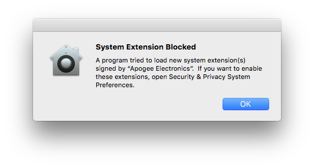
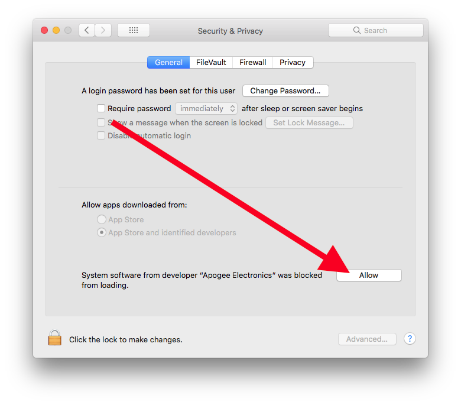

# FLTK Easy Setup MacOS

FLTK (pronounced "fulltick") is a cross-platform C++ GUI toolkit for UNIX®/Linux® (X11), Microsoft® Windows®, and MacOS® X. FLTK provides modern GUI functionality without the bloat and supports 3D graphics via OpenGL® and its built-in GLUT emulation.

To make it as simple as possible for students to use the FLTK library this repo was made.

## Installation


#### Step 1
Download this repository either by pressing Download ZIP or via git using the following command from terminal:

```bash
git clone https://github.com/larsgmu/PPP_FLTK_macOS.git
```
#### Step 2
Open the folder an run the following file

```bash
installation.program
```
#### Step 2.1
Now this prompt probabliy will show:



Press "Ok". Now open System Preferences -> Security & Privacy, on the lower right side press "Allow".




Now you can reopen the installation.program file, press ok and the installer starts.

#### Step 3
The installer will first ask you to press ENTER, do so. After pressing Enter it asks you to type in your password, do it(you will not see what you type, don't worry about this).

Installation is Done!


## Usage

The only file you need to worry about is the main.cpp, edit it as much as you want with any C++ editor og IDE. When you are done save the file, and run the script

```bash
installation.program
```
The first time you run the script the security promt as with the installation will probabli show, just do the same as in **2.1**. 

The script file will compile and run the project automaticly.

## Contributing
Pull requests are welcome. For major changes, please open an issue first to discuss what you would like to change.

Please make sure to update tests as appropriate.

## License
[MIT](https://choosealicense.com/licenses/mit/)

